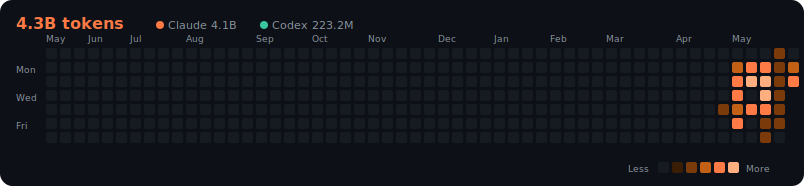

# Website

This website is built using [Docusaurus](https://docusaurus.io/), a modern static website generator.

## Installation

```bash
yarn
```

## Local Development

```bash
yarn start
```

This command starts a local development server and opens up a browser window. Most changes are reflected live without having to restart the server.

## Build

```bash
yarn build
```

This command generates static content into the `build` directory and can be served using any static contents hosting service.

## Deployment

Using SSH:

```bash
USE_SSH=true yarn deploy
```

Not using SSH:

```bash
GIT_USER=<Your GitHub username> yarn deploy
```

If you are using GitHub pages for hosting, this command is a convenient way to build the website and push to the `gh-pages` branch.

<!-- CLAUDE-USAGE:START -->

### 🤖 My AI Usage

  



**各模型**

| 模型 | 來源 | Tokens | 訊息 | 估算 API 等值 |
|------|------|-------:|------:|------:|
| `claude-opus-4-7` | Claude | 3.5B | 13,284 | $8,440 |
| `claude-opus-4-8` | Claude | 378.3M | 1,808 | $937 |
| `gpt-5.5` | OpenAI Codex | 223.2M | 1,935 | $44 |
| `claude-haiku-4-5-20251001` | Claude | 173.5M | 2,017 | $28 |
| `claude-sonnet-4-6` | Claude | 12.6M | 388 | $9 |

<sub>📊 由本機各 AI CLI 用量自動產生 · 熱力圖為每日 token 量 · 成本為 <b>API 等值估算</b>(訂閱制非按 token 計費)· 最後更新 2026-06-02 06:45 UTC</sub>

<!-- CLAUDE-USAGE:END -->
